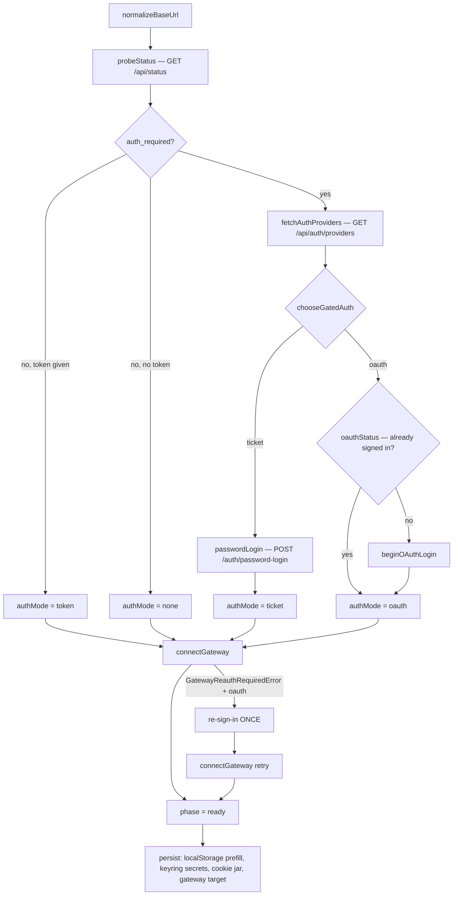
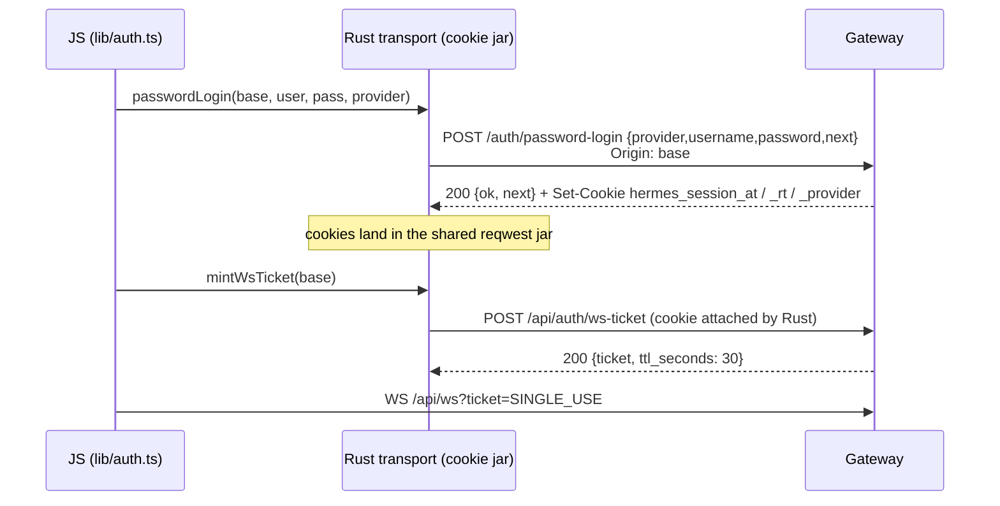

# Auth Lifecycle: every sign-in and sign-out flow

> **Audience:** Anyone touching login, sign-out, session restore, or reconnect
> **Source files:** `hermes_cli/dashboard_auth/` (~4k lines), `hermes_cli/auth.py` (~9.2k lines),
> `apps/hermes-universal/src-tauri/src/{oauth,cloud,transport}.rs` (~5.3k lines),
> `apps/hermes-universal/src/{lib/auth.ts,store/connection.ts,store/gateway-config.ts}`
> **Last updated:** 2026-09-15. Line references (`file:NNN`) drift with every change; search by the named symbol.

## Overview

There is no single "login" in this repo. There are **three unrelated auth
domains** that share vocabulary, share the word *provider*, and are routinely
conflated when debugging:

| Domain | What it authenticates | Owner |
|---|---|---|
| **A — provider auth** | *the agent* into a model provider (Nous, Codex, Anthropic, xAI, Qwen, MiniMax, Copilot, ~40 API-key providers) | `hermes_cli/auth.py` |
| **B — gateway auth** | *a human client* (Tauri app, browser SPA) into a Hermes gateway | `hermes_cli/dashboard_auth/` + `src-tauri/src/oauth.rs` |
| **C — service auth** | *the agent* into a third-party service (MCP servers, Spotify, Honcho, Graph, DingTalk, relay) | `tools/mcp_oauth*.py`, various |

When someone says "the login is broken", the first question is always **which
domain**. A user who cannot reach their gateway (B) and a user whose model calls
401 (A) describe the symptom identically.

**Two traps to internalise before reading further:**

1. **There are two different `auth.json` files.** `~/.hermes/auth.json` is Hermes's
   own provider credential store (domain A). `~/.codex/auth.json` is the OpenAI
   Codex CLI's, which Hermes *imports from, read-only*. They are unrelated.
2. **`provider` means three different things.** A `DashboardAuthProvider`
   (domain B: `nous`, `self-hosted`, `basic`, `drain-secret`), a model
   `ProviderConfig` (domain A: `nous`, `openai-codex`, `anthropic`, …), and an
   MCP server's OAuth provider (domain C). The name `nous` appears in two of
   them and means different credentials in each.

---

## 1. Repo shape — which surface performs which auth

| Surface | Path | Auth it performs |
|---|---|---|
| Python CLI + FastAPI dashboard | `hermes_cli/`, `gateway/`, `tui_gateway/` | **server of** A and B; **client of** A and C |
| Tauri desktop + Android/iOS | `apps/hermes-universal/` (`src/` React+nanostores, `src-tauri/` Rust) | **client of** B; hosts the onboarding UI for A |
| Browser SPA (dashboard) | `web/src/` | cookie session for B; browser-mediated login for A |
| Ink TUI | `ui-tui/` | **none of its own** — opens the portal in a browser and rides the gateway session |
| Bootstrap installer | `apps/bootstrap-installer/` | none |

`apps/desktop/` is the older Electron client, still a live surface; its auth is not
covered here. `native-auth-decisions.ts` in universal was ported from it.

---

## 2. Domain B — gateway sign-in

### 2.1 Capability negotiation: `/api/status`

Every gateway connect begins with an **uncredentialed** `GET /api/status`
(`probeStatus`, `src/store/connection.ts:133`). The gateway's reply is the whole
capability-negotiation surface:

| Field | Produced by | Meaning |
|---|---|---|
| `auth_required` | `should_require_auth(host)` — `hermes_cli/web_server.py:478` | the gateway is **gated**. True whenever it binds a non-loopback host. `--insecure` no longer turns this off; it only logs a warning |
| `auth_providers` | `[p.name for p in list_providers()]` | **all** registered providers, including token-only ones |
| `auth_flows` | `web_server.py:3400-3479` | `["cookie"]` when gated, `+ "native_pkce"` when at least one *session* provider is not password-based |
| `nous_session_valid` | `hermes_cli.auth.get_nous_session_validity()` (`auth.py:6796`) | `valid` / `terminal` / `unknown` — the only signal that a hosted agent's domain-A Nous grant died |

`/api/status` is **public by contract** (`dashboard_auth/public_paths.py`) — NAS
and the portal use it as a liveness probe. Host paths, PIDs and gateway ports are
added to the payload **only when `not auth_required`** (`web_server.py:3576`).

`auth_flows` being absent is the compatibility mechanism, not an error: an older
gateway simply never lists `native_pkce`, so every client falls back to the
cookie path with no version compare. That rule is one function:

```ts
// apps/hermes-universal/src/lib/native-auth-decisions.ts:45
statusSupportsNativeFlow(status)  // Array.isArray(auth_flows) && includes('native_pkce')
```

If `auth_required` is true and `list_providers()` is empty, the server **fails
closed at startup** with a `SystemExit` that splices in each auth plugin's
`LAST_SKIP_REASON` (`web_server.py:18249`). A gated gateway with no way to sign
in never boots.

### 2.2 The client's two enums

`apps/hermes-universal/src/store/gateway-config.ts` is the single source of truth
for "how do I reach this backend".

**`GatewayMode`** (`:20`) — where the backend lives:

| Mode | Meaning |
|---|---|
| `local` | a bundled backend this app spawned (desktop only) |
| `remote` | a URL the user typed |
| `cloud` | a `remote`-shaped connection whose `baseUrl` came from portal discovery |
| `ssh` | a token-authed backend on `127.0.0.1` reached through an SSH tunnel |

`modeIsRemoteLike` (`:56`) returns true for `remote`, `cloud`, and *undefined* —
but **not** `ssh`, because an SSH tunnel terminates at a loopback backend with a
static token and takes the `local` path, not the probe/OAuth path.

**`AuthMode`** (`:28`) — how the WS handshake authenticates:

| Mode | WS auth param | Notes |
|---|---|---|
| `none` | *(none)* | ungated backend |
| `token` | `?token=<static>` | loopback / local-spawn / ssh |
| `ticket` | `?ticket=<fresh>` | gated via password login; a new single-use ticket per connect |
| `oauth` | `?ticket=<fresh>` | gated via interactive OAuth; a mint failure means **the session expired** → re-open sign-in |

`ticket` and `oauth` are wire-identical. They differ only in what a **mint
failure** means, and that difference is the whole reason both exist.

### 2.3 Choosing a gated flow

```
authModeFromStatus(status)   // gateway-config.ts:91  → gated ? 'oauth' : 'none'
chooseGatedAuth(providers, hasPasswordCreds)  // :105
```

`chooseGatedAuth` is pure and total:

- password-login (→ `ticket`) wins **only** when the operator actually supplied
  credentials **and** an advertised provider sets `supports_password`;
- otherwise the interactive OAuth path, preferring a **non-password** provider,
  falling back to the first advertised, else the conventional `nous`.

A related pure rule lives next door: `oauthGuardMayHardFail`
(`native-auth-decisions.ts:84`) returns **false** when *every* advertised
provider is password-based, so a "not signed in" pre-flight cannot hard-fail a
gateway whose only login is a username and password — which would reject a live
session one line before the ws-ticket mint that would have succeeded. An unknown
or empty provider list keeps the strict answer, so gateways predating
`/api/auth/providers` are unaffected.

### 2.4 The connect sequence

`connect()` — `src/store/connection.ts:182`:



Phases published on `$connectionPhase`: `idle` → `probing` → `connecting` →
`ready`, or `error`. On any throw the store resets `$connection` to `null` and
publishes `$connectionError`.

The persistence tail (`connection.ts:251-258`) is deliberately ordered:
non-secret prefill (`hermes.url`, `hermes.username`) to localStorage, secrets to
the OS keyring **best-effort** (an unavailable keyring simply means secrets are
not persisted, not that the connect failed), then `persistSessionCookies()`, then
`saveGatewayTarget()` so the next launch auto-reconnects.

### 2.5 Flow B1 — password login → ws-ticket



Client: `passwordLogin` (`src/lib/auth.ts:24`), `mintWsTicket` (`:66`).
Server: `auth_password_login` (`dashboard_auth/routes.py:652`),
`api_auth_ws_ticket` (`:801`), `dashboard_auth/ws_tickets.py`.
The only in-tree password provider is `plugins/dashboard_auth/basic/`.

**Status-code contract** (`lib/auth.ts:36-50`) — each maps to distinct user copy:

| Status | Message |
|---|---|
| 401 | `Invalid username or password` |
| 404 | `This backend has no password login enabled` |
| 429 | `Too many login attempts — try again shortly` |
| other non-2xx | `Login failed (HTTP <n>)` |

The server returns **404 for both an unknown provider and a non-password
provider**, deliberately: neither a username nor a provider list should be
enumerable from this endpoint.

**Rate limiting** (`routes.py:610-635`): an in-process sliding window,
`_PW_RATE_MAX_ATTEMPTS = 10` per `_PW_RATE_WINDOW_SEC = 60.0`, keyed by the first
`X-Forwarded-For` entry or `request.client.host`. Behind a proxy that does *not*
forward, every client shares one bucket — this is documented in-file as
defence-in-depth, not the primary control.

**ws-tickets** (`ws_tickets.py`): `TTL_SECONDS = 30` (`:42`),
`mint_ticket` (`:62`), `consume_ticket` (`:81`) **pops before validating** so a
ticket is single-use whatever the outcome, and truncates the value in its error
string so a ticket never lands in a log in full.

### 2.6 Flow B2 — RFC 8252 native PKCE (`native_pkce`)

This is the flow that exists because the desktop app cannot be a direct OAuth
client of Nous Portal: the Portal's `client_id` is per-gateway-instance
(`agent:{instance_id}`) and it validates that `redirect_uri` ends in
`/auth/callback` **on the gateway's own public origin**, so a `127.0.0.1`
loopback redirect is rejected outright.

So **the gateway brokers**: it is the authorization server *to the app*, and an
OAuth client *to the Portal*. Full contract in the module docstring of
`hermes_cli/dashboard_auth/native_flow.py`.

```mermaid
sequenceDiagram
    participant App as App (oauth.rs)
    participant LB as loopback 127.0.0.1 PORT
    participant GW as Gateway
    participant P as Nous Portal
    App->>App: PKCE (cv_d, cc_d) + state; bind TcpListener BEFORE hand-off
    App->>GW: GET /auth/native/authorize?code_challenge=cc_d&code_challenge_method=S256<br/>&redirect_uri=http://127.0.0.1:port/callback&state=...
    GW->>GW: register_pending() -> opaque broker_state (256-bit)
    GW-->>App: 302 to Portal authorize; hermes_session_pkce cookie carries broker=BROKER_STATE
    App->>P: (sign-in window / calling webview)
    P-->>GW: GET /auth/callback?code&state
    GW->>GW: complete_pending() -> mints gw_code bound to cc_d + verified Session
    GW-->>LB: 302 redirect_uri?code=gw_code&state=CLIENT_STATE   (NO session cookies)
    LB-->>App: gw_code
    App->>GW: POST /auth/native/token {code: gw_code, code_verifier: cv_d}
    GW->>GW: redeem_code(): pop FIRST, then compare_digest(S256(cv_d), cc_d)
    GW-->>App: 200 {access_token, refresh_token, expires_at, provider, user_id} in the BODY
    App->>App: store in OS keyring; all REST uses Authorization: Bearer
```

**Server-side guarantees** (`native_flow.py`):

| Property | Mechanism |
|---|---|
| PKCE binding (RFC 7636) | the code is redeemable only by the client that presented `cc_d`; `cv_d` never leaves the app |
| Single use | `redeem_code` (`:260`) pops **before** the PKCE check — no verifier oracle, no replay |
| Short TTLs | `_PENDING_TTL_SECONDS = 600` (interactive window), `_CODE_TTL_SECONDS = 120` (loopback hop) |
| Opaque handles | `broker_state` and `gw_code` are 256-bit `secrets.token_urlsafe`, compared constant-time |
| DoS bound | `_MAX_ENTRIES = 256` global, `_MAX_PENDING_PER_IP = 8` — `/auth/native/authorize` is a **public pre-auth route** |
| No secret logging | tokens live in memory only between callback and redemption; the audit log strips token fields |

**Redirect validation** (`routes.py:254`): only `http://127.0.0.1` or
`http://[::1]`. **`localhost` is rejected** — RFC 8252 §8.3, because `localhost`
can resolve through a hostile resolver. Plain PKCE is rejected; S256 only.

**Client-side, `src-tauri/src/oauth.rs`.** The pure, unit-tested half lives in
`mod native` (`generate_pkce`, `loopback_redirect_uri` — an IP literal, never
`localhost` — `build_authorize_url`, `parse_callback_target`,
`parse_token_response`, `needs_refresh`). The I/O half:

| Step | Function | Notes |
|---|---|---|
| lease | `claim_sign_in` | a process-wide `SIGN_IN_IN_FLIGHT` lease held for the whole command; three callers can drive a sign-in and none coordinate. Shared with `cloud.rs::portal_login` |
| probe | `advertises_native_flow` (`:902`) | a probe failure answers **"no"** — falling back is always safe; guessing "yes" strands the user |
| drive | `run_native_login` (`:1251`) | binds the listener **before** the hand-off |
| serve | `serve_loopback_socket` (`:930`) | reads only the request line, serves a **static** page that never echoes the code; per-socket read deadline `LOOPBACK_SOCKET_READ_SECS = 10` |
| accept | `await_loopback_code` (`:985`) | serves sockets **concurrently** — a browser preconnect used to stall the real callback in the accept backlog |
| exchange | `post_native_tokens` (`:1124`) | refresh token scrubbed from every error string |
| persist | `store_native_tokens` (`:853`) | **fails the login if the keyring write fails**: a token set that never reached the keyring is a session that is already dead |

**Where the user types their password differs by platform, and that difference
is load-bearing:**

- **Desktop** opens a dedicated Tauri webview window labelled `hermes-oauth`
  (`open_sign_in_window`, `:1033`). It is outside `capabilities/default.json`'s
  `windows` globs, so it has no IPC. `await_loopback_code_in_window` (`:1081`)
  races the code against the window closing. Timeout
  `NATIVE_LOGIN_TIMEOUT_SECS = 300`.
- **Android and iOS** navigate the app's **only** webview to the authorize URL
  and back (`native_login_after_navigate`, `:1470`), because neither phone can
  host a dismissable second window. `watch_for_departure` (`:1441`)
  distinguishes `Refused` (navigation never committed) from `Abandoned`
  (hardware back). Timeout `MOBILE_NATIVE_TIMEOUT_SECS = 240`.

**Neither platform uses the system browser**, despite RFC 8252 §8.1. The app does
own `hermes://` (MJXHRM-455), but the gateway accepts only a loopback redirect
(`_validate_loopback_redirect_uri`), so a browser that cannot reach the loopback
listener has no way home. The loopback socket is the only door.

**Consequence for JS:** on mobile, `oauthLogin` **may never resolve**, because
the navigation destroys the JS context. See §2.10.

### 2.7 Flow B3 — the legacy cookie cascade

When the gateway does not advertise `native_pkce`, `oauth_login` falls back to
navigating a webview to `{base}/auth/login?provider={provider}` (default `nous`)
and polling for a session cookie (`poll_session_cookies`, `oauth.rs:1670`).
Timeouts `OAUTH_TIMEOUT_SECS = 300` desktop / `OAUTH_TIMEOUT_SECS_MOBILE = 240`.

`is_session_cookie` (`:1640`) matches by **suffix**, so `__Host-` and `__Secure-`
variants are recognised.

**The `navigated` rule.** `NativeLoginError` carries a `navigated: bool`. When
`navigated == true` the caller must **not** fall back to the cookie cascade,
because that would send the user to a second, *different* login page. Desktop
sets it only on user-cancel; mobile sets it as soon as the hand-off is issued.

### 2.8 Flow B4 — Nous Portal (Privy) and cloud-agent silent SSO

`src-tauri/src/cloud.rs`. The portal session is **not** an Hermes session at all —
it is a Privy session, detected purely by cookie presence: `privy-token`,
`__Host-privy-token`, `__Secure-privy-token`, `privy-session`
(`is_privy_cookie`, `:89`).

| Command | Line | Behaviour |
|---|---|---|
| `portal_login` | `:186` | desktop: a persistent window `hermes-portal` with its own `data_directory` (`<app data>/portal-webview`) so the Privy session survives restarts (`build_portal_window`, `:122`); kept hidden between calls. Mobile: runs in the calling webview |
| `portal_discover_agents` | `:414` | `GET {portal}/api/agents` with the Privy cookie bridged into reqwest. 401 → `needs_login`, 409 → `needs_org_selection` |
| `portal_status` | `:521` | non-prompting liveness read |
| `portal_agent_sign_in` | `:566` | silent per-agent SSO (below) |

**Silent SSO into a cloud agent** (`portal_agent_sign_in`):

1. `GET {agent}/auth/login?provider=nous` with **redirects off** and an explicit
   `Origin` — captures the Portal authorize URL from `Location` and lands the
   gateway's `hermes_session_pkce` cookie in the shared jar.
2. `agent_sso`: **desktop** (`:611`) drives the hidden portal webview to the
   authorize URL — same `data_directory`, so the Privy session auto-approves for
   org members with no prompt — with an `on_navigation` intercept on the
   `{base}/auth/callback` prefix. **Mobile** (`:741`) has no portal webview, so
   it bridges the Privy cookies into the shared jar and lets a
   redirect-following reqwest client walk the cascade itself.
3. Completing the callback over reqwest lands `hermes_session_at` / `_rt` in the
   shared gateway jar, after which the ws-ticket mint authenticates exactly like
   a manual OAuth login.
4. Identity check: `GET {base}/api/auth/me`.

**`PORTAL_REVEAL_AFTER_MS = 4000`** (`:62`): if desktop's silent SSO stalls, the
hidden window is **revealed**, because an invisible MFA prompt otherwise burns
the whole budget with nothing on screen. Mobile has no reveal-on-stall — its
recovery is Sign out → Sign in.

The server-side counterpart to "silent" is `_auto_sso_response`
(`middleware.py:166`) plus the Portal's auto-approval of org members.

### 2.9 Flow B5 — token mode (`local`, `ssh`)

Neither performs auth negotiation, because both terminate at a backend the app
itself started.

- **`connectLocal`** (`connection.ts:271`, desktop only) — Rust spawns the
  bundled backend and resolves only once it is HTTP-ready, returning
  `{baseUrl, token}`. A failed connect calls `stopLocalBackend()` so no orphan
  child is left behind.
- **`connectSsh`** (`:320`) — Rust spawns (or reattaches to) `hermes serve` on the
  remote host and forwards a loopback port. No `/api/status` probe, no auth
  negotiation. A **cold connect can take 45–90 s**, which is why `onProgress`
  exists: without it the UI shows a motionless spinner long enough to read as a
  hang. `activeSshAttempt` is tracked so `disconnect()` can abort a dial that is
  still running — otherwise "Use a different gateway" only *looks* like it
  worked while Rust keeps spawning on the remote.

Because an ssh `baseUrl` carries a fresh ephemeral port on every re-tunnel,
`connectionCacheKey` (`gateway-config.ts:69`) keys on `remoteIdentity` instead,
so a reconnect does not throw away the file tree for a backend that is literally
the same process.

### 2.10 Session restore on launch

`autoRestoreConnection` — `src/store/gateway-restore.ts:256`.

localStorage keys:

| Key | Const | Purpose |
|---|---|---|
| `hermes.connection.last` | `TARGET_KEY` (`:30`) | the target to auto-reconnect to |
| `hermes.oauth.pending` | `PENDING_OAUTH_KEY` (`:110`) | one-shot marker: a mobile OAuth hand-off is in flight |
| `hermes.portal.pending` | `PENDING_PORTAL_KEY` (`:154`) | same, for a portal login |

Boot order: `takePendingOAuth()` → if a marker was parked, `oauthStatus(base)`;
signed in ⇒ `connect()` and broadcast the gateway switch. Otherwise
`loadGatewayTarget()` → `dialSavedTarget()` in a bounded ladder
(`MAX_RESTORE_ATTEMPTS` with `reconnectBackoffDelayMs`) while `$restoring` holds
the connecting screen.

**Why the marker exists.** `beginOAuthLogin` (`connection.ts:158`) parks it
*before* calling `oauthLogin`, because on mobile that call navigates the app away
and never returns. The post-reload boot is the actual completion mechanism. And
it is `take`n back on **rejection** (`:176`) — a rejection means we never
navigated, so the marker would otherwise sit in localStorage and fire on some
unrelated later launch, seeding `$restoring` and sending the boot down a resume
branch for a sign-in that never happened.

### 2.11 The server gate

`gated_auth_middleware` — `hermes_cli/dashboard_auth/middleware.py:323`. Decision
ladder, in order:

1. **Not gated** (`app.state.auth_required` false) → pass.
2. **`request.state.token_authenticated`** (set by the outer token seam) → pass.
3. **Public path** (`_path_is_public`, `:68`) → pass. Public = exact match in
   `PUBLIC_API_PATHS` **or** a prefix match against `_GATE_PUBLIC_PREFIXES`
   (`:49`): `/auth/login`, `/auth/callback`, `/auth/native/{authorize,token,refresh}`,
   `/auth/password-login`, `/auth/logout`, `/login`, `/api/auth/providers`,
   `/api/mcp/oauth/callback/`, `/assets/`, `/favicon.ico`, `/ds-assets/`,
   `/fonts/`, `/fonts-terminal/`.
4. **Bearer** (`_extract_bearer` `:281` → `_verify_bearer` `:290`). This is the
   RFC 8252 path. A bearer that is **presented but invalid returns 401
   immediately** — it never falls through to cookies. All providers unreachable
   → 503.
5. **No cookies at all** → `_auto_sso_response` (`:166`) if eligible, else
   `_unauth_response(reason="no_cookie")`.
6. **Verify** across `_ordered_session_providers(hint)` (`:96` — a stable sort
   putting the provider-hint cookie first; the hint is *not* authoritative). A
   `ProviderError` from one provider does **not** abort the chain. Only "nobody
   verified **and** at least one was unreachable" → **503**.
7. **Refresh** (`_attempt_refresh`, `:547`) when the access token did not verify.
   On success the response gets **rotated cookies re-set** — mandatory, because
   the Portal rotates refresh tokens with reuse detection. Total failure →
   `_unauth_response("invalid_or_expired_session")` + `clear_session_cookies`.
   Any provider unreachable → **503 with cookies preserved**.
8. Success → attach `request.state.session`, run the request, and back-fill the
   `hermes_session_provider` hint cookie if it was absent.

**401 vs 302** (`_unauth_response`, `:112`): a path under `/api/` gets **401
JSON** `{error, detail, reason, login_url}`; anything else gets a **302** to
`{prefix}/login?next=…`. The reason is concrete: `fetch()` would follow a 302
into the cross-origin OAuth dance opaquely, producing an unreadable failure
instead of an actionable one.

**`next` validation** (`_safe_next_target` `:244`, `_validate_post_login_target`
`routes.py:562`): must start with a single `/`; rejects `//`, `/login`,
`/auth/*`, `/api/auth/*`, and **all** `/api*` (landing on an API path post-login
would render raw JSON). Query string preserved, then `quote(..., safe="")`.

**Auto-SSO** (`_auto_sso_response`, `:166`) fires only when: the path is not
`/api/*`, the one-shot `hermes_sso_attempt` cookie is absent, **exactly one**
session provider is registered, and it is not password-based. It emits a 302 to
`{prefix}/auth/login?provider=<name>` and sets the 60 s loop-guard cookie. If the
marker is already present it falls back to `/login` and clears the marker.

**Middleware order.** Starlette runs `@app.middleware` outermost-last, so the
declaration order in `web_server.py` (573 → 688) means execution order:
`_token_auth_seam` → legacy `auth_middleware` (`_SESSION_TOKEN`) →
`_dashboard_auth_gate` → `_plugin_api_runtime_gate` → `host_header_middleware`.

**CSRF.** OAuth CSRF is the `state` parameter compared against the PKCE cookie
(`routes.py:441`). There is **no separate CSRF token** on `/auth/password-login`
or `/auth/logout`; `SameSite=Lax` plus the JSON content type are the only
protection. Host and origin checks live in `web_server.py`, not here:
`host_header_middleware` (`:573`) rejects a mismatched `Host` (DNS rebinding,
GHSA-ppp5-vxwm-4cf7), CORS is `^https?://(localhost|127\.0\.0\.1)(:\d+)?$`, and
WS upgrades go through `_ws_host_origin_reason`.

### 2.12 The four dashboard-auth providers

`plugins/dashboard_auth/`. All register through
`ctx.register_dashboard_auth_provider`, which runs `assert_protocol_compliance`
and rejects duplicate names. Each exposes a module-level `LAST_SKIP_REASON` that
the fail-closed startup branch splices into its error.

| Provider | `name` | password | token | session | Upstream |
|---|---|---|---|---|---|
| `nous` | `nous` | ✗ | ✗ | ✓ | Nous Portal OAuth, `client_id = agent:{instance_id}` |
| `self_hosted` | `self-hosted` | ✗ | ✗ | ✓ | generic OIDC discovery |
| `basic` | `basic` | **✓** | ✗ | ✓ | none — local scrypt |
| `drain` | `drain-secret` | ✗ | **✓** | **✗** | none — shared secret |

**`nous`** — authorize `{portal}/oauth/authorize`, token
`{portal}/api/oauth/token`, JWKS `{portal}/.well-known/jwks.json`.
`verify_session` is a **local JWT verify** (RS256, JWKS cached 300 s), pinned on
`agent_instance_id` and an `oauth_contract_version` of 1. `refresh_session`
sends the refresh token in the `x-nous-refresh-token` **header** *and* the body —
header-only gets a 400. Sessions carry `user_id = sub` and deliberately **no
PII**: `email` and `display_name` are empty by contract.

**`self_hosted`** — lazy discovery at
`{issuer}/.well-known/openid-configuration` (issuer must be HTTPS or loopback;
a discovery document whose advertised `issuer` mismatches is rejected). The
session's `access_token` field holds the **ID token**, not the OAuth access
token — Hermes only needs identity. Supports confidential clients via
`HERMES_DASHBOARD_OIDC_CLIENT_SECRET`.

**`basic`** — no IDP and no database. `start_login`/`complete_login` raise
`NotImplementedError`. Passwords use stdlib `hashlib.scrypt`
(`n=2**14, r=8, p=1, dklen=32`) encoded `scrypt$n$r$p$<salt>$<dk>`; an unknown
username is compared against a `_DUMMY_HASH` so the endpoint is not a timing
oracle, and the username itself is compared with `compare_digest`. **Sessions
are stateless HMAC-SHA256-signed blobs** — `{sub, kind, exp}`, 12 h access /
30 d refresh. If `secret` is unset a random per-process secret is generated, so
every session dies on restart and multi-worker does not work.

**`drain`** — never offered as a login (`supports_session = False` filters it
out of `list_session_providers()`). It verifies `HERMES_DASHBOARD_DRAIN_SECRET`
with `hmac.compare_digest` and registers the token route
`/api/gateway/drain`. Fail-closed entropy gate: ≥ 43 url-safe chars, ≥ 16
distinct characters, ≥ 128 bits Shannon entropy.

### 2.13 Credential storage

| Credential | Where | Notes |
|---|---|---|
| gateway session cookies | the Rust reqwest **cookie jar** — ONE jar shared by every registered connection (MJXHRM-526 splits it) — persisted to the keyring `cookies` entry | `src/lib/session-persist.ts` round-trips via `cookies_export` / `cookies_import`; re-persisted on every transition to `ready` (debounced) and flushed on backgrounding; a `lastPersisted` memo avoids redundant keyring writes; `cookies_import` never replaces a jar that already holds a live session |
| RFC 8252 bearer + refresh | OS keyring, account **`nativeAuth:<base-url>`** | `secrets::OwnedKey::NativeAuth`. **Rust-only** — there is no generic credential command, so the webview cannot reach it |
| password / static token / ssh material | OS keyring. The legacy owner (the `local` row, or the single connection a migration minted) keeps the bare accounts `token`, `password`, `sshKey`, `sshPassphrase`, `sshPassword`; every other registered connection uses `conn:<id>/token`, `conn:<id>/sshKey`, … and `conn:<id>/header/<name>` | `src-tauri/src/connections/secrets.rs` (MJXHRM-446); the webview supplies a credential once, write-only, on `connections_save` |
| installation identity | keyring account `installationId` | **not a secret**; deliberately survives `clearSecrets` |
| non-secret prefill | `localStorage`: `hermes.url`, `hermes.username` | |
| reconnect / resume state | `localStorage`: `hermes.connection.last`, `hermes.oauth.pending`, `hermes.portal.pending` | |

Keyring service is `"hermes"`. Backends: Android Keystore, iOS Keychain (Protected
Data), macOS login keychain, Windows Credential Manager, Linux Secret Service.

**macOS is a special case.** A macOS keychain ACL check is per-item and
per-direction, and an ad-hoc-signed build gets a password dialog for *each* one.
So macOS stores exactly **one** keychain item — `MASTER_KEY_ACCOUNT = "vaultKey"`,
32 random bytes — and seals every other secret into `<app data dir>/secrets.vault`
(AES-256-GCM, `src-tauri/src/secrets/vault.rs`). Credentials an earlier build stored
as items (a per-item login-keychain entry, or the Protected Data store an even
earlier macOS build selected) move into the vault on first read; the old item is
deleted only after the vault has been re-read and holds the value.
`code_identity.rs` detects ad-hoc signing and surfaces
`SecureStoreStatus.adHocSigned` so the UI can explain the single dialog.

**The bearer never crosses IPC** (MJXHRM-354). `src-tauri/src/transport.rs` reads
it from an in-memory cache (filled from the keyring, keyed by base URL) and attaches it per request; `gateway_bearer()`
(`oauth.rs:1618`) is the only way it leaves the module. `oauth_status` returns a
`sessionKind` discriminator and nothing else, pinned by the Rust unit test
`the_status_reply_never_carries_the_bearer` (`oauth.rs:2111`).

**Cookies, server side** (`dashboard_auth/cookies.py`):

| Cookie | Max-Age | Notes |
|---|---|---|
| `hermes_session_at` (`:73`) | `max(60, exp - now)` | access token |
| `hermes_session_rt` (`:74`) | `_RT_MAX_AGE` = 30 d (`:125`) | written only when non-empty |
| `hermes_session_provider` (`:78`) | 30 d | non-secret routing hint |
| `hermes_session_pkce` (`:79`) | `_PKCE_MAX_AGE` = 600 s (`:126`) | `provider=…;state=…;verifier=…[;next=…][;broker=…]` |
| `hermes_sso_attempt` (`:111`) | 60 s | one-shot auto-SSO loop guard (name deliberately unrenamed) |

All are `HttpOnly`, `SameSite=Lax`, `Path = prefix or /`, and `Secure` only when
`detect_https(request)`. Name prefix (`_resolved_name`, `:136`): bare on HTTP,
`__Host-` on HTTPS with `Path=/`, `__Secure-` when a proxy prefix forces
`Path != /` (`__Host-` forbids a non-root path). **Readers try all three
variants** (`_NAME_VARIANTS`, `:116`).

### 2.14 Refresh, expiry, and re-auth

**Native bearer** — `ensure_native_tokens` (`oauth.rs:1539`): in-memory cache
(skipped when `force_refresh`, or a 401 would loop forever) → keyring →
`needs_refresh` with a 60 s skew → `POST /auth/native/refresh`. The refresh is
**single-flighted per gateway base** (`refresh_gate`, MJXHRM-527): concurrent boot
callers queue, and a waiter takes a rotation that landed while it waited instead
of replaying the consumed refresh token. A rotation that cannot be *persisted* is
survivable (kept in memory for the run). **Only a 401/403 refusal drops the stored
session**; an unreachable gateway, a 5xx or an unreadable body keeps it, and
`oauth_status` answers `reachable: false` ("unknown", not signed out).

**Transport ladder** — `transport.rs`: `bearer_base_for_url` (`:495`) matches by
origin + prefix, `note_no_bearer_base` (`:463`) stops per-request keyring reads
for gateways with no session, and the **401 → force rotation → replay once**
ladder lives at `:761-800`.

**ws-ticket 401** — `mintWsTicket` raises a **typed**
`GatewayReauthRequiredError`, not a bare `Error`. This matters because three
independent call sites branch on `isGatewayReauthRequired`: the connect retry,
the reconnect supervisor's auth budget, and the mobile stand-down. The `ticket`
arm of `resolveWsUrl` mints directly rather than through `resolveGatewayWsUrl`,
so it used to raise a plain `Error` that none of them recognised — and a password
gateway's expiry was therefore retried forever on the network ladder instead of
being reported as a dead credential.

**Reconnect budgets** — `runReconnectLoop` (`connection.ts:734`) keeps
`authAttempts` **separate** from the network `attempt` counter, capped at
`MAX_AUTH_ATTEMPTS = 3` (`:653`). `wakeReconnect()` (foreground) refunds the
budget, so the cap ends a spinner rather than ending the session.

**The stand-down.** A non-cloud reauth during reconnect is **refused on every
platform** and the loop stands down with `$connectionPhase = 'error'`
(`standDown`). On mobile an interactive sign-in hijacks the only webview; on
desktop it is a window nobody asked for. Only cloud keeps a carve-out, because its
`portalAgentSignIn` is a silent reqwest cascade. Refusals are recognised three
ways (`isGatewayReauthRequired`, close codes 4401/4403, and a pre-accept
`HTTP error: 401|403`; `src/lib/gateway-auth-failure.ts`), and `connect()` never
opens a login page unless `allowInteractive` is true — which only a person's
click passes (the configurator's Connect, and `selectConnection` from the
source switcher, command palette and connection editor).

---

## 3. Domain A — provider sign-in

### 3.1 Storage

| What | Path |
|---|---|
| main store | `$HERMES_HOME/auth.json` (`~/.hermes/auth.json`; `%LOCALAPPDATA%\hermes\auth.json`) |
| lock | `$HERMES_HOME/auth.lock`, 15 s timeout |
| shared Nous store (cross-profile) | `$HERMES_SHARED_AUTH_DIR` or `<root>/shared/nous_auth.json` |
| env credentials | `$HERMES_HOME/.env` |
| Anthropic PKCE tokens | `$HERMES_HOME/.anthropic_oauth.json` |
| Copilot exchanged JWT cache | `$HERMES_HOME/.copilot_jwt.json` (0600, size-capped) |
| MCP OAuth tokens | `$HERMES_HOME/mcp-tokens/<server>.{json,client.json,meta.json}` |
| *imported, read-only* | `~/.codex/auth.json`, macOS Keychain `Claude Code-credentials`, `~/.claude/.credentials.json` |
| *imported, read-write* | `~/.qwen/oauth_creds.json` |

`auth.json` shape:
`{version, updated_at, active_provider, providers{}, credential_pool{}, suppressed_sources{}}`.
Writes are atomic (`O_EXCL` + `0o600` + `fsync` + `atomic_replace`, parent dir
`0o700`). A corrupt file is moved to `auth.json.corrupt` rather than discarded.

`_load_auth_store` **re-raises `OSError`** rather than degrading to an empty
store — an `EMFILE`/`EACCES` read would otherwise be one `_save_auth_store` away
from erasing every credential.

### 3.2 The flows

| Provider | Mechanism | Endpoints / client | Refresh skew | Notable |
|---|---|---|---|---|
| **nous** | Device code (RFC 8628) | `POST {portal}/api/oauth/device/code` → poll `POST {portal}/api/oauth/token`; client `hermes-cli`, scope `inference:invoke` | 120 s | rotating **single-use** refresh tokens with reuse detection; a validated *invoke JWT* must carry the `inference:invoke` scope or you get `subscription_required` |
| **openai-codex** | Device code (OpenAI's bespoke shape) | `POST auth.openai.com/api/accounts/deviceauth/usercode` → poll `.../deviceauth/token` (403/404 = pending) → exchange at `/oauth/token` | 120 s | **429 is quota, not auth** → `relogin_required = False` |
| **xai-oauth** | OIDC discovery + device code | `auth.x.ai/.well-known/openid-configuration`, `/oauth2/device/code` | **3600 s** | the long skew is deliberate, for cron and gateway workloads. The endpoint is re-validated on every refresh so a hand-edited `auth.json` cannot exfiltrate the refresh token. **403 is an entitlement tier gate**, not a dead credential |
| **minimax-oauth** | PKCE + `user_code` grant | `api.minimax.io` / `api.minimaxi.com` | 60 s | `expired_in` is sometimes a Unix-ms timestamp; there is an explicit sniffer for that |
| **anthropic** | OAuth + PKCE, **manual code paste** | `claude.ai/oauth/authorize` → paste `code#state` → `platform.claude.com/v1/oauth/token` | — | the token POST must send UA `axios/1.7.9`; a `claude-code/*` UA is 429-blocked at the *token* endpoint. `state` mismatch aborts (CSRF) |
| **claude-code** | borrow Claude Code's credentials | macOS Keychain `Claude Code-credentials`, else `~/.claude/.credentials.json`; or `claude setup-token` | — | pool source `claude_code` |
| **qwen-oauth** | borrowed from the Qwen CLI | reads/refreshes `~/.qwen/oauth_creds.json` at `chat.qwen.ai/api/v1/oauth2/token` | 120 s | Hermes writes back atomically at 0600 |
| **copilot** | GitHub device code → JWT exchange | `github.com/login/device/code` → poll → `GET api.github.com/copilot_internal/v2/token` | 120 s | discovery order `COPILOT_GITHUB_TOKEN` → `GH_TOKEN` → `GITHUB_TOKEN` → `gh auth token`. `gho_`/`github_pat_`/`ghu_` accepted; **classic `ghp_` PATs rejected** |
| **copilot-acp** | CLI shell-out (`copilot /login`) | `acp://copilot` | — | credentials owned entirely by the subprocess |
| **~40 API-key providers** | paste a key | `.env` / auth store | — | placeholder sentinels (`LMSTUDIO_NOAUTH_PLACEHOLDER`) do not count as credentials |

Headless handling is shared: `_is_remote_session()` detects SSH / Cloud Shell /
Codespaces, suppresses `webbrowser.open`, and prints the `ssh -L` loopback hint
instead.

### 3.3 Entry points

| Entry | Location |
|---|---|
| `hermes auth add\|list\|remove\|reset\|status\|logout\|spotify` | `hermes_cli/subcommands/auth.py` → `hermes_cli/auth_commands.py:778` |
| `hermes auth` (bare, interactive menu) | `auth_commands.py:547` |
| `hermes login` | **removed** — prints a deprecation and exits 0 |
| `hermes logout [--provider …]` | `hermes_cli/auth.py:9211` |
| `hermes portal [login\|info\|status\|open\|tools]` | `hermes_cli/portal_cli.py` |
| `hermes setup` / `hermes model` | `hermes_cli/setup.py:873` → `hermes_cli/model_setup_flows.py` |
| Browser SPA "Accounts" tab | `web/src/components/OAuthProvidersCard.tsx` → `OAuthLoginModal.tsx` |
| App onboarding / Settings → Providers | `apps/hermes-universal/src/app/onboarding/`, `src/store/onboarding.ts` |
| TUI model picker | `ui-tui/src/components/modelPicker.tsx` → RPC `model.save_key` |

**Browser-mediated login** uses an in-memory server-side session store
(`_oauth_sessions`, TTL 15 min): `POST /api/providers/oauth/{id}/start` → open
`auth_url` (pkce) or `verification_url` (device_code) in a tab → poll
`GET /api/providers/oauth/{id}/poll/{sid}` every 2 s, or paste a code to
`POST …/submit`. Unmount → `DELETE /api/providers/oauth/sessions/{sid}`, which
sets `cancelled` **under the lock, before popping**, so a live worker stops
instead of racing a save.

The `pkce` branch is hardcoded to `provider_id == "anthropic"`
(`web_server.py:11266`) after a real bug where a `pkce`-flagged MiniMax silently
launched the Anthropic flow.

### 3.4 The credential pool

`agent/credential_pool.py` gives every provider multi-credential failover.
Entries live under `auth.json → credential_pool`, seeded from singletons
(`hermes_pkce`, `claude_code`, `device_code`, `gh_cli`, `qwen-cli`, `oauth`),
from env (`env:<VAR>`), and from custom config (`config:<name>`).

| Status | Meaning |
|---|---|
| `OK` | usable |
| `EXHAUSTED` | rate-limited; a TTL cooldown parsed from the provider's retry-delay |
| `DEAD` | terminal OAuth revocation — excluded **unconditionally** until a write-side re-login |

---

## 4. Domain C — third-party service auth

| Flow | Files | Shape |
|---|---|---|
| **MCP OAuth 2.1** | `tools/mcp_oauth.py`, `tools/mcp_oauth_manager.py`, `tools/mcp_dashboard_oauth.py` | auth-code + PKCE + **dynamic client registration**, driven by the MCP SDK's `OAuthClientProvider`. Loopback callback server, 300 s window, paste fallback, or a dashboard-mediated bridge. Entry: `hermes mcp login <name>` |
| **Spotify** | `hermes_cli/auth.py` | loopback PKCE, default redirect `http://127.0.0.1:43827/spotify/callback`. `hermes auth spotify [login\|status\|logout]` |
| **Honcho** | `plugins/memory/honcho/oauth*.py` | PKCE + loopback; rotating single-use refresh token with reuse detection |
| **DingTalk** | `hermes_cli/dingtalk_auth.py` | 3-step device flow with a terminal QR code, yields AppKey/AppSecret |
| **Microsoft Graph** | `tools/microsoft_graph_auth.py` | client credentials, `.default` scope |
| **Vercel Sandbox** | `hermes_cli/vercel_auth.py` | pure env reporting, no flow |
| **Relay (connector ⇄ gateway)** | `gateway/relay/auth.py` | **HMAC-SHA256, not OAuth**. Upgrade token `base64url(payload:exp:sig)`; inbound signature over exact body bytes with a 300 s replay window; a multi-secret verify list for rotation |

**MCP cross-process staleness** is handled explicitly: the manager watches the
token file's `st_mtime_ns` and reloads when another process (cron, a second CLI)
refreshed on disk. A 401 storm is deduplicated through `pending_401` futures
keyed by the failed access token, so N concurrent tool calls trigger exactly one
recovery.

---

## 5. Sign-out — the full catalogue

Sign-out is where the domains leak into each other. Read this section as
carefully as §2.

### 5.1 Gateway sign-out, client side

`signOut()` — `src/store/connection.ts:490`:

```ts
const conn = $connection.get()
suspendSessionCookiePersistence()
if (conn && (conn.authMode === 'oauth' || conn.authMode === 'ticket')) await oauthLogout(conn.baseUrl).catch(() => {})
if (conn?.mode === 'cloud') await portalLogout().catch(() => {})
if (conn) await clearSessionJar(conn.baseUrl)
await forgetSavedLogin().catch(() => {})
clearGatewayTarget(); clearPendingOAuth(); clearPendingPortal()
disconnect()
```

| Step | Guard | What it clears |
|---|---|---|
| `oauthLogout(base)` → `invoke('oauth_logout')` | `authMode` `oauth` **or** `ticket` (a password session's cookie lives in the same jar) | native tokens from the keyring **first and unconditionally** (`clear_native_tokens`, `:893` — `forget_bearer_base` + `secrets::remove_owned(NativeAuth, base)`), then `POST {base}/auth/logout` on a **non-redirecting** client, presenting the bearer |
| `portalLogout()` → `cloud.rs:485` | **only `mode === 'cloud'`** | desktop: `clear_all_browsing_data()` on the hidden `hermes-portal` window. **Mobile: there is one cookie store, so this drops the gateway session too** — an in-file comment accepts that as "at worst a re-login" |
| `clearSessionJar(base)` → `cookies_clear` | a live connection | removes only the cookies whose domain matches `base` — the jar is shared by every registered connection, so a whole-jar clear would sign the user out of other sources |
| `suspendSessionCookiePersistence()` | always | latches persistence off until the next deliberate connect (`armReconnect`), so a background flush cannot write the jar back into the keyring the sign-out cleared |
| `clearGatewayTarget()` + both resume markers | always | the next launch does not paint "Reconnecting" and dial a gateway it has no credential for; `hermes.url` / `hermes.username` stay as the prefill |
| `forgetSavedLogin()` | always | `forgetPersistedSessionCookies()` (drops the in-memory memo **before** the wipe, so the memo cannot outlive the keyring entry it describes) then `clearSecrets()` |
| `disconnect()` (`:449`) | always | the socket, the local child (`mode === 'local'`), the SSH tunnel (`mode === 'ssh'`), a still-running SSH dial. Sets `$hasConnected(false)` so the root gate falls back to the connect picker rather than the reconnecting screen |

**Four things to know about this ladder:**

1. **Single-jar debt (MJXHRM-526).** `forgetSavedLogin` still wipes the one
   keyring snapshot of the shared jar, and the persistence latch pauses
   persisting for every source until the next deliberate connect; the live jar
   itself is cleared per gateway.
2. **`clearSecrets` deliberately keeps `installationId`**
   (`src/lib/secure-store.ts:203`) — it is an identity, not a credential.
3. **`clearSecrets` returns a boolean and it is meaningful.** It resolves
   `false` when the wipe did not land (keystore unreachable, or it refused). A
   failed wipe used to be indistinguishable from a clean one, so any UI claiming
   "signed out everywhere" must check the return value. `signOut` currently
   swallows it with `.catch(() => {})`.
4. **`disconnect()` alone is not a sign-out.** It drops the socket and nothing
   else. `$oauthSession` (`lib/auth.ts:173`) is keyed by base URL precisely so a
   probe of *some other* gateway cannot clear — or falsely assert — the session
   being rendered.

`cloudSignOut()` (`src/store/cloud.ts:200`) is the portal-only variant: it calls
`portalLogout()` and resets the discovery stores (`$portalSignedIn`,
`$cloudAgents`, `$cloudOrgs`, `$cloudOrg`, `$cloudDiscover`) in a `finally`, so
the UI leaves the signed-in state even if the clear failed.

### 5.2 Gateway sign-out, server side

`POST /auth/logout` — `dashboard_auth/routes.py:744`:

```
rt = read_session_cookies(request)[1]
if rt:
    for provider in list_providers():        # ALL providers, not just the hinted one
        try: provider.revoke_session(refresh_token=rt)
        except Exception: log and continue   # best-effort, never raises
audit_log(LOGOUT)
resp = RedirectResponse(f"{prefix}/login", 302)
clear_session_cookies(resp, prefix)
clear_pkce_cookie(resp, prefix)
```

**The revoke is gated on the refresh-token *cookie*.** A native (RFC 8252)
session has **no cookies at all** — its refresh token lives in the OS keyring —
so `rt` is `None` and the loop never runs. The bearer that `oauth_logout` takes
care to present is used for authentication, not to locate a refresh token. In
practice this is currently moot for `nous` (whose `revoke_session` is a no-op
anyway) but it is a real gap for a `self-hosted` OIDC deployment with a working
RFC 7009 revocation endpoint: a native sign-out there is **local only**.

**Cookie clearing** (`cookies.py:244`, `:284`) emits `Max-Age=0` for every
prefix variant (`__Host-`, `__Secure-`, bare) **×** canonical and legacy name.

**What "revoked" actually means, per provider:**

| Provider | `revoke_session` | Consequence |
|---|---|---|
| `nous` (`:369`) | **deliberate no-op** — the Portal exposes no revoke grant | sign-out is cookie clearing plus the refresh token's own TTL. An already-issued access token stays valid until its `exp` |
| `self-hosted` (`:322`) | best-effort **RFC 7009** `POST revocation_endpoint` with client auth; swallows everything | genuine server-side revocation when the IDP supports it |
| `basic` (`:285`) | no-op — sessions are stateless HMAC blobs with nothing to revoke | a captured token stays valid until `exp` (12 h access / 30 d refresh). The **only** kill switch is rotating `HERMES_DASHBOARD_BASIC_AUTH_SECRET`, which invalidates every session at once |
| `drain-secret` (`:203`) | returns `None`; `supports_session = False` | never part of a login or a logout. Rotate `HERMES_DASHBOARD_DRAIN_SECRET` instead |

**Not affected by any user sign-out:**

- **ws-tickets** are not revoked — they are single-use with a 30 s TTL and simply
  expire.
- **`internal_ws_credential()`** (`ws_tickets.py:110`) is process-lifetime,
  multi-use and never-expiring. It is handed only to spawned children via env
  (the embedded-TUI PTY child reuses its attach URL across reconnects) and is
  **never injected into HTML or any REST response**. Only a gateway restart
  rotates it.

**Browser SPA sign-out**: `AuthWidget.tsx:117` → `api.logout()`
(`web/src/lib/api.ts:369`) → `POST /auth/logout` → follow the 302 with a
**full-page** `window.location.assign("/login")`. A full navigation, not a
client-side route change, so no stale authenticated state survives in the SPA.

### 5.3 Provider sign-out (domain A) — four operations, not interchangeable

| Operation | Entry | Effect |
|---|---|---|
| `hermes logout [--provider …]` | `auth.py:9211` | `get_active_provider` (`:1777`) → `_should_reset_config_provider_on_logout` (`:7358`) → `clear_provider_auth` (`:1898`) deletes `providers[id]` **and** `credential_pool[id]` and nulls `active_provider` → `_reset_config_provider` (`:7381`) rewrites `config.yaml` |
| `hermes auth remove <p> <N>` | `auth_commands.py:464` | removes **one pooled entry** through the `RemovalStep` contract |
| `hermes auth reset <p>` | `auth_commands.py:502` | clears `EXHAUSTED` cooldowns only — **credentials survive** |
| deactivate | `deactivate_provider` (`auth.py:1938`) | clears `active_provider` **without deleting anything** (used when switching to OpenRouter or a custom provider) |

A `KeyboardInterrupt` during a Nous login exits `130`; a skipped model-selection
step **restores the prior `active_provider`** rather than leaving the store
half-switched (`auth.py:9169-9186`).

**The removal contract** — `agent/credential_sources.py`. Its docstring records
exactly why it exists: before it, every source had an ad-hoc branch in
`auth_remove_command` and **several had no branch at all**, so `auth remove`
silently reverted on the next `load_pool()` for `qwen-cli`, `nous` device_code
(partially), `hermes_pkce`, Copilot `gh_cli`, and custom-config sources — the
seeding pass simply re-imported them.

Every source now registers a `RemovalStep` (`:79`) doing the same three things:

1. clean up the externally-readable state it reads from (a `.env` line, an
   `auth.json` block, an OAuth file);
2. `suppress_credential_source(provider, source_id)` so the matching
   `_seed_from_*` branch skips the upsert on reload;
3. return a `RemovalResult` with `cleaned` (what was mutated) and `hints`
   (state deliberately left intact — a shell-exported env var, Claude Code's own
   credential file — always non-destructive).

| Source | Step | Cleans |
|---|---|---|
| `env:<VAR>` | `_remove_env_source` (`:143`) | the `.env` line; **hints** about a shell-exported var it cannot unset |
| `claude_code` | `:202` | suppression only — Claude Code's own files are **not** deleted |
| `hermes_pkce` | `:215` | `~/.hermes/.anthropic_oauth.json` |
| `device_code` (nous) | `:248` | the `auth.json` provider block |
| minimax / xai / codex | `:263` / `:276` / `:296` | the respective `auth.json` blocks |
| `qwen-cli` | `:330` | `~/.qwen/oauth_creds.json` |
| `gh_cli` (copilot) | `:343` | suppression; the `gh` CLI's own token is left alone |
| `config:<name>` | `:372` | the `custom_providers` entry |

`suppressed_sources` is sticky and lives in `auth.json`. `hermes auth add` clears
the provider's suppressions again (`auth_commands.py:184`) — otherwise a
re-login would be silently ignored by the seeding pass.

**Surface-specific removals:**

- Dashboard `DELETE /api/providers/oauth/{provider_id}` (`web_server.py:10278`)
  — for `anthropic` it also unlinks `~/.hermes/.anthropic_oauth.json` and can only
  *mention* the macOS Keychain entry, which it cannot remove.
- TUI `model.disconnect` (`tui_gateway/methods_complete.py:460`) →
  `remove_provider_env_credential` per env var + `clear_provider_auth`.
- Copilot's exchanged JWT is a separate cache: `evict_cached_exchanged_token`
  (`copilot_auth.py:375`) plus `~/.hermes/.copilot_jwt.json`. Removing the GitHub
  token does not by itself invalidate a cached Copilot JWT.

### 5.4 Third-party sign-out (domain C)

| Operation | Call | Effect |
|---|---|---|
| forget one MCP server's tokens | `remove_oauth_tokens(server_name)` (`tools/mcp_oauth.py:1032`) | deletes the token file |
| the storage-level primitive | `HermesTokenStorage.remove()` (`:559`) | deletes `<server>.json` |
| the manager-level primitive | `manager.remove()` (`mcp_oauth_manager.py:590`) | evicts the in-process provider cache **and** deletes the disk tokens — use this one, or a cached provider keeps serving a token you just deleted |
| force re-registration | `poison_client_registration()` (`mcp_oauth.py:608`) | deletes `<server>.client.json` + `.meta.json` (keeping a backup) so the next login re-runs dynamic client registration |
| transactional re-auth | `snapshot()` (`:564`) / `restore(only_if_absent=)` (`:579`) | the dashboard flow snapshots before removing so a failed re-auth can roll back |
| Spotify | `hermes auth spotify logout` | clears `providers.spotify` |
| Relay | rotate `GATEWAY_RELAY_SECRET` / `GATEWAY_RELAY_DELIVERY_KEY` in `~/.hermes/.env` | there is no session to revoke; the verify list exists to allow rotation without downtime |

### 5.5 Involuntary sign-out

Identical symptom, completely different code. This table is the fastest triage
in the document.

| Trigger | Handler | Observable |
|---|---|---|
| Every provider rejects the refresh | `middleware.py` step 7 | 401 `session_expired` + `clear_session_cookies` (or a 302 for an HTML path) |
| One provider unreachable, none verified | `middleware.py` steps 6–7 | **503, cookies preserved.** A flaky IDP must not force a re-login |
| A presented bearer is invalid | `middleware.py` step 4 | 401 immediately; **no cookie fallback** |
| Gateway rejects the bearer on a status probe | `oauth_status` (`oauth.rs:2005`) | `clear_native_tokens`; the UI shows signed out |
| ws-ticket mint 401s | `mintWsTicket` (`lib/auth.ts:66`) | typed `GatewayReauthRequiredError` → one re-sign-in in `connect()`, then the reconnect ladder's `authAttempts` budget |
| Native refresh refused (401/403) | `ensure_native_tokens` | the stored session is dropped. An unreachable gateway or a 5xx keeps it (a rotation that only fails to *persist* is survivable for the run) |
| Nous refresh terminal (`invalid_grant`, refresh-token reuse) | `_quarantine_nous_oauth_state` (`auth.py:5524`) + `_quarantine_nous_pool_entries` (`:5609`) + `_clear_shared_nous_state` (`:5460`) | `/api/status` reports `nous_session_valid: "terminal"` |
| Pool entry declared `DEAD` | `agent/credential_pool.py` | excluded unconditionally until a write-side re-login |
| Loopback `_SESSION_TOKEN` stale after a server restart | WS close **4401** → `web/src/lib/dashboard-auth-reload.ts` | exactly one page reload, guarded by `sessionStorage["hermes.tokenReloadAttempted"]` |
| Reconnect needs an interactive reauth | `runReconnectLoop` | **refused; the loop stands down** (`$connectionPhase = 'error'`, the connecting screen says it stopped). Only cloud's silent SSO may re-auth from the background |

**WS close codes** (`web_server.py:15267-15335`):

| Code | Meaning |
|---|---|
| `4401` | bad or missing credential (ticket, internal credential, or stale session token) |
| `4403` | host or origin mismatch |
| `4410` | the child process exited |

In gated mode a legacy `?token=<_SESSION_TOKEN>` on the WS upgrade is
**unconditionally rejected**; only `?internal=` and `?ticket=` are accepted.

---

## 6. Edge cases and known debt

### 6.1 `AuthError` codes (domain A)

`AuthError(RuntimeError)` (`auth.py:874`) carries `provider`, `code`,
`relogin_required`, `retry_after`. The distinction that matters:

| Code | `relogin_required` | Because |
|---|---|---|
| `subscription_required` | — | the Nous invoke JWT lacks `inference:invoke`; point the user at `{portal}/billing` |
| `refresh_token_reused` | **True** | Nous rotates refresh tokens with reuse detection; a reuse revokes the whole grant chain |
| `CODEX_RATE_LIMITED_CODE` | **False** | a 429 from Codex is quota, not a dead credential |
| `xai_oauth_tier_denied` | **False** | a 403 from xAI is an entitlement tier gate |

Treating either of the last two as a credential failure sends the user through a
pointless re-login that cannot fix anything.

### 6.2 Other sharp edges

- **No CSRF token** on `/auth/password-login` or `/auth/logout` —
  `SameSite=Lax` plus the JSON content type are the only protection.
- **`GET /api/providers/oauth/{id}/poll/{sid}` is unauthenticated** by design. It
  leaks only `status` / `error_message` / `expires_at`, and the session id is
  `secrets.token_urlsafe(16)`.
- **The password rate limiter is process-local and `X-Forwarded-For`-keyed.**
  Behind a proxy that does not forward, all clients share one bucket.
- **`basic` with no configured `secret`** generates a random per-process secret:
  every session dies on restart, and multi-worker does not work at all.
- **`plugins/model-providers/gemini/plugin.yaml`** advertises "API key + Cloud
  Code OAuth", but the profile is `auth_type="api_key"` and no Gemini OAuth
  exists in this tree. Stale description.
- **`localhost` is rejected as a loopback redirect** (`routes.py:254`). If a
  client sends it, that is the bug — not the gateway.

---

## 7. Triage: symptom → where to look

| Symptom | Domain | Start here |
|---|---|---|
| App cannot connect to a gateway at all | B | `probeStatus` (`connection.ts:133`); is `/api/status` reachable and what is in `auth_flows`? |
| Sign-in opens the wrong kind of window / no window | B | `advertises_native_flow` (`oauth.rs:902`) then `run_native_login` vs the cookie cascade |
| Sign-in never completes on Android/iOS | B | `beginOAuthLogin` (`connection.ts:158`) + `hermes.oauth.pending` + `autoRestoreConnection` |
| Signed in, then immediately "signed out" | B | `oauthSessionIsLive` (`native-auth-decisions.ts:58`) — a cookie-only liveness check reports signed out right after a **native** login |
| Connects, then the WS handshake fails | B | ws close code: 4401 credential, 4403 origin, 4410 child exit |
| Loops between the app and the login page | B | `hermes_sso_attempt` loop guard + `_auto_sso_response` (`middleware.py:166`) |
| 401 storm against a gated gateway | B | `_verify_bearer` (`middleware.py:290`) then the transport rotate-and-replay ladder (`transport.rs:761`) |
| Everything 503s but credentials look fine | B | the IDP is unreachable — `middleware.py` returns 503 with cookies preserved on purpose |
| "Signed out" but the server still accepts the token | B | `revoke_session` semantics per provider (§5.2) — `nous` and `basic` are both no-ops |
| Sign-out did not stick | B | `signOut` (`connection.ts`): the logout guard, `clearSessionJar(base)`, the persistence latch, `clearGatewayTarget` |
| `auth remove` reverts on the next run | A | a missing `RemovalStep` / an unsuppressed source (`agent/credential_sources.py`) |
| Model calls 401 while the gateway is fine | A | `resolve_nous_runtime_credentials` (`auth.py:6198`), then the pool's `DEAD` / `EXHAUSTED` statuses |
| Model calls 429 and the UI says "log in again" | A | check `relogin_required` — Codex 429 and xAI 403 are **not** credential failures (§6.1) |
| An MCP server keeps re-authorising | C | `poison_client_registration` / the cross-process `st_mtime_ns` reload in `mcp_oauth_manager.py` |
